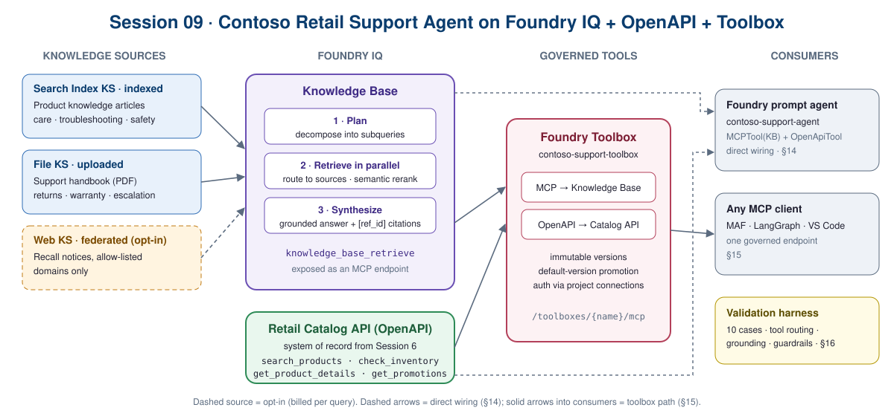

# Session 09: Contoso Retail Support Agent on Foundry IQ + OpenAPI + Toolbox

Session 8's support agent knew five policies from its prompt. This session rebuilds it the way a
production support agent is built: **knowledge** from a Foundry IQ knowledge base, **live facts** from
the Session 6 Retail Catalog API, both **governed** in a versioned toolbox, and a **validation
harness** as the quality gate.



## What you build

| Layer | Answers | Built with |
|---|---|---|
| Knowledge | Policy, product care, troubleshooting, safety | Foundry IQ knowledge base over 3 sources: indexed product articles, uploaded handbook PDF, federated recall notices (opt-in) |
| System of record | Stock by size and store, product details, promotions | `OpenApiTool` over the Session 6 API (anonymous / connection / managed identity) |
| Agent | Routes between the two, cites, refuses safely | Foundry prompt agent: `MCPTool` (KB via project managed identity) + `OpenApiTool` |
| Governance | One approved tool set for every support agent | Foundry Toolbox: immutable versions, default promotion, one MCP endpoint |
| Quality gate | Routing, grounding, guardrails, prompt injection | 10-case harness; results feed Session 11 |

## Run it

1. Complete the prerequisites in notebook §1. **New resource:** an Azure AI Search service (Basic+,
   semantic ranker on). You also need an embedding deployment.
2. `cp .env.example .env` and fill in the required values.
3. `az login`, open `09_contoso_retail_foundry_iq.ipynb`, and run top to bottom.

Sections whose optional settings are blank skip cleanly. Cleanup (§19) is **off by default**
because Sessions 10–12 reuse the KB, toolbox, and agent.

## Notebook map

| § | Section | § | Section |
|---|---|---|---|
| 1–2 | Prerequisites, clients | 12 | KB as an MCP server |
| 3 | Identity & auth design | 13 | Retail Catalog API (OpenAPI) |
| 4 | Product-knowledge index | 14 | The support agent |
| 5–7 | Knowledge sources: indexed · uploaded · federated | 15 | Support toolbox + governed change (15a) |
| 8 | Knowledge base + answer contract | 16 | Validation harness |
| 9–10 | Hero query, activity trace, references, multi-turn | 17–18 | Failure modes, production checklist |
| 11 | Tuning effort and output mode | 19–20 | Cleanup, next steps |

## Files

```text
session-09-contoso-retail-foundry-iq/
├── 09_contoso_retail_foundry_iq.ipynb
├── README.md · knowledge-check.md · .env.example · .gitignore
├── data/
│   ├── product_knowledge.json                ← 24 articles (indexed source)
│   ├── contoso-retail-support-handbook.pdf   ← uploaded source (.md is the editable original)
│   ├── contoso-retail-support-handbook.md
│   └── eval_cases.jsonl                      ← 10 harness cases
└── media/09-architecture.svg
```

## Cost

| Resource | Billing |
|---|---|
| Azure AI Search service | **Hourly while it exists**, even when idle. Delete after Session 12 if not reused. |
| Semantic ranker | Per query beyond the free monthly allowance |
| KB planning and synthesis | Model tokens per retrieval (see §11 for the effort trade-off) |
| Web knowledge source | Per query, which is why it's off by default |

> Structure adapted from microsoft-foundry/forgebook `mastering-foundry-iq` and `mastering-foundry-toolbox` (MIT). Use case, data, agent design, and harness are original to this course.
