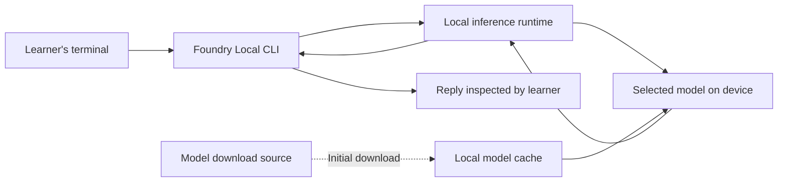
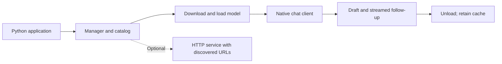

# 2. Architecture Flow

For this exercise the learner supplies the facts directly. There is no inventory lookup or knowledge-base retrieval. When evaluating a response, ask whether it preserves those facts and admits what it cannot determine.

Separate three observations: obtaining model files, loading the model, and generating an answer. Your evidence should identify which stage succeeded or failed.

Foundry Local can also expose an OpenAI-compatible local service with a dynamic endpoint. The Python exercise uses a native chat client. Its optional HTTP exercise starts the service, reads its reported URLs, and stops it afterward.

## Python SDK architecture

| State | What to inspect |
|---|---|
| Catalog | Advertised models; discovery does not prove download. |
| Cached | Files stored locally; presence does not prove active inference. |
| Loaded | Models available in runtime memory. |

Use the CLI for exploration and Python for application sequencing, exceptions, and cleanup. The SDK exercises use the `foundry_local_sdk` native API. Older `foundry_local` examples belong to a different API generation.
