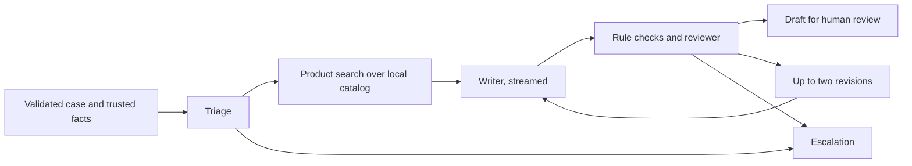

# Architecture and Trust Boundaries

`src/api` separates the application the way the Zava Creative Writer does:

| File | Responsibility |
|---|---|
| `foundry_config.py` | Initialize the native runtime, load one model, share one chat client |
| `agents/*.py` | Each agent's instructions, output contract and entry point |
| `orchestrator.py` | `Pipeline`: stage order, feedback loop, call budget, progress messages |
| `contracts.py` | Shared instructions, case validation and rule checks |
| `main.py` | FastAPI service that streams progress messages and serves `ui/` |

`Pipeline` coordinates the agents using separate native SDK calls with role instructions. It validates exact JSON keys and types before passing outputs downstream. All roles share one loaded model, with fresh messages for every invocation and case.

| Agent | Output contract | Responsibility |
|---|---|---|
| Triage | `category`: mismatch or other | Route supported requests |
| Product | `queries`: one to five short strings | Propose catalog search queries |
| Writer | `reply`: nonempty string | Draft from supplied facts and catalog matches |
| Reviewer | `approved`: boolean; `reasons`: list | Reject unsupported claims |

The product agent sees only the trusted facts, never the customer message. Its queries are combined with the ordered and received fact values and matched against `catalog/products.json` by keyword overlap. If its output stays malformed, the search continues with the fact values alone, so retrieval never depends on the model.

A run has at most twelve model calls, one format repair per invocation and two draft revisions. Failed triage, writer or reviewer contracts, backend errors, rejected drafts and exhausted budgets escalate without releasing a reply. Unsupported categories also escalate.

## Progress messages

`Pipeline.create` yields one message per step, and `POST /api/reply` sends each as a line of JSON:

| `type` | Meaning |
|---|---|
| `message` | An agent is starting; `data.agent` names it |
| `triage`, `product`, `writer`, `reviewer` | That agent finished; `data` holds its outcome |
| `partial` | One streamed writer token |
| `error` | The run escalated on a failure; only the error type is reported |
| `result` | Always last; `data` is the full run result |

`partial` tokens are unreviewed draft text shown for responsiveness. Only the `result` message carries a reply, and only after rule checks and the reviewer accept it.

## Trust boundaries

Fixture `facts` and the local catalog are trusted. Customer messages and reviewer feedback are untrusted model inputs. Only triage and the writer receive the customer message; the product agent and the reviewer work from trusted data and the draft alone, so injected text cannot reach them directly. Prompts cannot establish a security boundary. A real order integration must supply verified facts through authorized data access. No tools or external side effects are enabled. Successful drafts still require a human.

The web service has no authentication and serializes runs on one model. Bind it to `127.0.0.1` for the lab.
