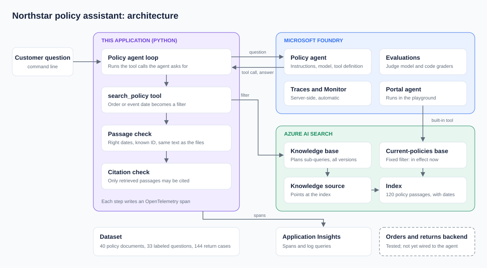

# Session 13: Enterprise Agentic RAG with Microsoft Foundry and Azure AI Search

A retail support agent for the fictional Northstar Retail. Azure AI Search agentic retrieval explains the policies with evidence; a deterministic backend decides and performs the business actions. All data is synthetic. No real payments, carrier labels or customer messages are involved, and a "return" is a stored mock authorization.

The build follows [instruction.md](instruction.md) in stages. This README states what exists now.

## Architecture



Details are in [docs/architecture.md](docs/architecture.md).

## Status

| Stage | What | State |
|---|---|---|
| 1 | Dataset, integrity checks, architecture | Done |
| 2 | Policy engine, repository, tool service, deterministic tests | Done, runs locally |
| 3 | Search index, knowledge source, knowledge base, filtered retrieval | Done; provisioned and queried against Azure AI Search |
| 3 | Policy-only Foundry agent with cited answers | Done; published to Foundry and queried |
| 4 | Agent with operational tools, chat client | Not built |
| 5 | Evaluations registered in Foundry | Policy agent: done, 27-question baseline published. Tool workflows: waits on stage 4 |
| 6 | Tracing and monitoring | Policy agent traced to Application Insights, queries verified. No dashboards or alerts created |
| 7 | Infrastructure, CI, deployment | Not built |

Stages 3 onward need Azure resources and role assignments; [docs/azure-setup.md](docs/azure-setup.md) lists them. Nothing has been run against Azure yet. The Entra token path is tested with locally generated keys, not a live tenant.

## Layout

```text
instruction.md            Build specification
northstar-dataset/        Synthetic policies, orders, evaluation sets (see its README)
docs/architecture.md      Components, confirmation design, threat assumptions
docs/azure-setup.md       Azure resources, role assignments and troubleshooting
docs/demo.md              A 15-minute walkthrough across the portal and the terminal
docs/evaluation.md        Metrics, judge, release gates, baseline results, what is published to Foundry
docs/observability.md     Spans, redaction, monitoring queries, suggested alerts
src/northstar/
  policies.py             Policy metadata and version selection by date
  eligibility.py          Return rules, driven by policies.json
  repository.py           Persistence interface and the SQLite implementation
  service.py              The tools: ownership, proposals, confirmed writes, idempotency, audit
  auth.py                 Caller identity: Entra token validation, and a local demo stub
  api.py                  FastAPI tool service
  rag/catalog.py          Chunk catalog and validation
  rag/azure.py            Index, embeddings, ingestion, knowledge source and knowledge base
  rag/retrieval.py        Date-filtered retrieval and evidence validation
  rag/cli.py              plan, provision, status, ask, teardown
  evals/retrieval.py      Retrieval metrics against the labeled evidence chunks
  agent/policy_agent.py   Foundry agent definition, tool loop and citation check
  agent/portal_agent.py   Playground agent: current-policies knowledge base, project connection, built-in tool
  agent/cli.py            create, ask, chat, delete, and the portal-* commands
  evals/policy_agent.py   Agent evaluation: deterministic checks, model grades, publish to Foundry
  telemetry.py            OpenTelemetry spans and export
scripts/check_azure.py    Preflight check of the Azure setup
tests/                    70 tests, no model and no Azure required
```

## Run it locally

```powershell
python -m venv .venv
.venv\Scripts\Activate.ps1
python -m pip install -r requirements.txt
python -m pip install -e .
python -m unittest discover -s tests -v
```

Start the tool service against a working copy of the dataset:

```powershell
$env:NORTHSTAR_AUTH_MODE = "demo"
$env:NORTHSTAR_FIXED_DATE = "2026-10-03"
python -m northstar.setup_db
python -m uvicorn northstar.main:app --host 127.0.0.1 --port 8000
```

`demo` mode trusts the `X-Demo-Customer-Id` header and exists only for local use. Interactive API documentation is at <http://127.0.0.1:8000/docs>. `python -m northstar.setup_db --reset` restores the working database from the dataset.

## Retrieval

Needs the Azure setup in [docs/azure-setup.md](docs/azure-setup.md). Commands that create, change or delete Azure objects, or make billed calls, require `--confirm`.

```powershell
python -m northstar.rag.cli plan                  # what provisioning would do; reads only
python -m northstar.rag.cli provision --confirm   # index, 120 documents, knowledge source, knowledge base
python -m northstar.rag.cli status
python -m northstar.rag.cli ask "How long do I have to return headphones?" --order-date 2026-08-20
python -m northstar.evals.retrieval --confirm     # retrieval metrics on the development questions
python -m northstar.rag.cli teardown --confirm    # delete everything provisioning created
```

`ask --local` and `evals.retrieval --local` use a keyword fallback that needs no Azure. It is labeled as a fallback and says nothing about the real service's quality.

The knowledge base ranks chunks but cannot know which policy version applies, and fifteen topics have identical text in both versions. Every request therefore carries a date filter (order date for eligibility and fee policies, event date for operational ones), and every returned chunk is checked again against the local policy files before it counts as evidence. This uses preview features: SDK `azure-search-documents` 12.1.0b2 and REST API `2026-08-01-preview`.

First baseline on the 27 development questions, top 6 chunks, low reasoning effort, measured once on 2026-10-04:

| Metric | Knowledge base | Keyword fallback |
|---|---|---|
| Recall@6 | 0.875 | 0.590 |
| All evidence found | 0.750 | 0.458 |
| MRR | 0.876 | 0.471 |
| nDCG@6 | 0.837 | 0.456 |
| Chunks outside their effective dates | 0 | 0 |

Recall is 1.0 on version-dependent questions and 0.94 on single-topic ones, and 0.64 on multi-topic questions, which is where it is weakest. The question set is small and author-written, so treat these as a smoke test. The held-out split has not been run.

## Policy agent

A Foundry prompt agent that answers policy questions only. Its single tool, `search_policy`, is a function tool executed by this code, so the date filter and evidence validation apply to everything the model sees.

```powershell
python -m northstar.agent.cli create --confirm    # publish the agent definition to the Foundry project
python -m northstar.agent.cli ask "I placed my order on 2026-08-20. How long do I have to return headphones?"
python -m northstar.agent.cli chat
python -m northstar.agent.cli delete --confirm
```

Each answer is checked after the model writes it:

- Every citation, such as `[electronics-returns-v1-chunk-1]`, must name a passage retrieved for that answer.
- A policy answer must cite at least one passage. An answer that the policies do not cover the question is accepted only if the agent searched first.
- Dates after today are refused, because the model does not know the date and will invent one.
- A request blocked by Azure's content filter returns a fixed refusal.

An answer that fails is returned with `verified: false`; deciding what to show the customer in that case belongs to the client (stage 4). The agent appears in the Foundry portal under Agents as `northstar-policy-agent`, and its runs appear under Traces.

Because the tool runs in this process, this agent cannot answer in the Foundry playground: the playground has nothing to execute `search_policy`.

### Portal agent

For the playground, a second agent runs entirely inside Foundry. It reaches a knowledge base through Foundry's built-in MCP tool, as in Microsoft's tutorial. That tool cannot send a per-request filter, so the agent gets its own knowledge base, permanently filtered to the policies in effect now.

```powershell
python -m northstar.agent.cli portal-create --confirm   # knowledge base, project connection, agent
python -m northstar.agent.cli portal-ask "What is the return shipping fee for a change-of-mind return?"
python -m northstar.agent.cli portal-delete --confirm
```

It needs `PROJECT_RESOURCE_ID` in `.env` and the Foundry Project Manager role. Open `northstar-portal-agent` under Agents in the Foundry portal and use its Playground and Traces tabs. It answers questions about current policy correctly; for an order placed under an older version it can only say that an older version may apply. Selecting the version by order date is what the code-driven agent above is for.

## Evaluation and tracing

```powershell
python -m northstar.evals.policy_agent                      # what a run would do; free
python -m northstar.evals.policy_agent --confirm --limit 5  # sample: run the agent, grade, publish to Foundry
```

The run reports deterministic checks (citation validity, abstention, retrieval and citation overlap), six model-graded metrics, and three release gates, and prints a link to the run in Foundry. See [docs/evaluation.md](docs/evaluation.md).

Set `NORTHSTAR_TRACING=azure` in `.env` to export spans for each question and search to Application Insights. Spans carry IDs and outcomes, not the customer's words. See [docs/observability.md](docs/observability.md) for what is recorded and for monitoring queries.

## The tools

| Tool | Endpoint | Writes |
|---|---|---|
| `get_order` | `GET /orders/{order_id}` | No |
| `check_return_eligibility` | `POST /returns/eligibility` | No |
| `create_return` | `POST /returns` | Yes |
| `get_return_status` | `GET /returns/{return_id}` | No |
| `propose_cancel_order` | `POST /cancellations/proposal` | No |
| `cancel_order` | `POST /cancellations` | Yes |
| `propose_support_ticket` | `POST /tickets/proposal` | No |
| `create_support_ticket` | `POST /tickets` | Yes |

Every write needs a proposal from its read-only step, a confirmation token, and an `Idempotency-Key` header. The token comes from `POST /confirmations`, which only the customer-facing client may call and which is left out of the OpenAPI document so it is never registered as an agent tool. The agent can prepare an action but cannot confirm it.

## What the tests establish

- All 144 labeled return cases produce the expected outcome, policy IDs and fee through the service, and write nothing.
- Another customer's order is indistinguishable from a missing one.
- No write happens without a confirmation; a token for one action cannot drive another; confirmations expire.
- Eligibility, ownership and order status are re-checked inside the write transaction.
- A retried write with the same key returns the original result; concurrent attempts cannot return more units than were purchased.
- Overlapping or missing policies go to review instead of being decided.
- Entra tokens with a wrong signature, audience, issuer, expiry or an unlinked subject are rejected.

These are tests of the backend on synthetic data. They say nothing yet about retrieval or answer quality.
