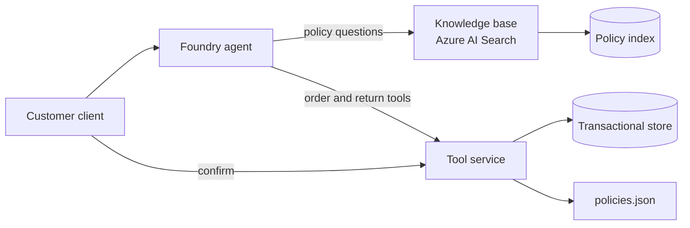

# Architecture

## Two separate paths

**Retrieval explains.** Policy documents are chunked, embedded and indexed. The knowledge base retrieves evidence for the agent's answers. This path is not built yet (stage 3).

**The backend decides.** Eligibility, fees and every write are computed by the tool service from `policies.json` and the transactional store. The model never determines an outcome; it relays one. Private order data stays out of the shared policy index.

## Tool service

| Module | Responsibility |
|---|---|
| `policies.py` | Loads policy metadata. `applicable(topic, date, region)` returns the one policy in effect, or raises a conflict for zero or several. |
| `eligibility.py` | Applies the return rules in a fixed order. Reads every number from policy `parameters`. A conflict yields `review_required`. |
| `repository.py` | `UnitOfWork` interface and a SQLite implementation. Writes take the lock up front (`BEGIN IMMEDIATE`), so concurrent writers queue. |
| `service.py` | Tools, ownership checks, proposals, confirmed writes, idempotency and audit. |
| `auth.py` | Derives the customer from the request's credentials. |
| `api.py` | HTTP surface and input validation. |

SQLite is the local development store. The service depends only on the `UnitOfWork` interface, so Azure SQL or PostgreSQL can replace it; that implementation must keep the same guarantee that a write transaction is serialized and atomic.

## Policy version selection

Eligibility and fee policies apply by **order date**; operational policies apply by the date of the event. Each policy's `applies_by` field states which. Fifteen topics have identical text in both versions, so the correct version can only be selected by date, never by ranking. The engine does this from metadata; stage 3 must do the same for retrieved evidence, by filter or by backend validation.

## Confirmation

A boolean "confirmed" argument would be controlled by the model. So would a token the model can request for itself. The design separates who can prepare an action from who can approve it:

1. A read-only tool returns a **proposal**: the exact action, stored server-side with the actor, the bound details (order, item, quantity, fee, policy IDs) and an expiry.
2. The **customer-facing client** shows the summary and, when the customer agrees, calls `POST /confirmations`. This endpoint requires the customer channel and is hidden from the OpenAPI document, so it is not an agent tool. It returns a one-time token; only its hash is stored.
3. The write tool takes the proposal ID and token. In one transaction it checks the idempotency key, the proposal's actor, action, expiry and token, then **re-evaluates** ownership, eligibility, status and quantity before changing anything.

A proposal is consumed by its write. The details executed are those stored in the proposal, not arguments supplied at write time.

In demo mode the channel is a header. With Entra it is a scope (`ENTRA_CONFIRM_SCOPE`) that only the client application's tokens carry. That separation is only as strong as the app registration that issues the scope.

## Idempotency

Each write requires an idempotency key, stored hashed with the actor, action and proposal. The same key and request returns the original result with no new side effect. The same key with a different request fails. A new key on an already-used proposal fails. Because the lookup and the write share one serialized transaction, concurrent retries produce one side effect.

## Audit

Attempts, successes and failures are written to `audit_log` with actor, action, result, order ID, policy IDs, proposal ID, a hash of the idempotency key and the trace ID from the `traceparent` header. Tokens, ticket text and raw keys are not stored there. A failed write is audited in a separate transaction because its own was rolled back. Audit rows are business records and are independent of trace sampling.

## Threat and permission assumptions

- **Identity comes from credentials, never from content.** IDs in chat or request bodies do not authenticate anyone; extra body fields are rejected.
- **No existence disclosure.** A missing order and another customer's order return the same 404.
- **Retrieved text and customer text are untrusted.** They cannot change an outcome, because outcomes come from the backend. They can still mislead the model's wording; that is an evaluation concern for later stages.
- **The demo identity stub is unsafe by design.** It is selected only by `NORTHSTAR_AUTH_MODE=demo`, logs a warning at startup, and the default mode is `entra`, which refuses to start without a tenant and audience.
- **The tool service must not be reachable by end users directly in demo mode.** Bind it to localhost.
- **Subjects map to customers through `customer_identities`.** Populating that table is an onboarding step outside this project.

## Not yet verified

- Entra validation against a live tenant, including key rotation.
- Any Azure component: indexing, the knowledge base, the agent, evaluations, tracing.
- Behaviour on a production database engine.
- Rate limiting, request size limits and abuse controls.
